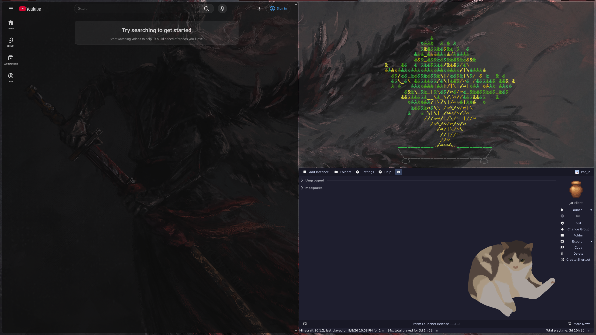

<!-- ref:
Paste:
<p><a href="">Here</a></p>

-->
<!-- My title Jar <3 -->
<div align="center">
  <h1 style="color:#d3866d; border-bottom: none; font-size: 2.5em; margin-bottom: 0;">NixOS in a Jar ❄️</h1>
  <code style="background-color: #3e3835; color: #e6dbb2; padding: 4px 8px; border-radius: 4px;">Version: Iler-26.7.16</code>
  <p style="margin-top: 10px; color: #8a7a71;"><i>Written by me! [Park / Jar]</i></p>
</div>

<!-- My header Stats <3> -->
<div align="center">
  <p>
      <!-- link to nixos -->
    <a href="https://nixos.org/">
      
    </a>
    <!-- Repo Size -->
    <!--<a href="https://github.com/">
      
    </a>-->
    <!-- install guide -->
    <a href="./resjar/docbin/install-guide.md">
      
    </a>
    <!-- directory documentations -->
    <a href="./resjar/docbin/directory-key.md">
      
    </a>
    <!-- header bottom -->
    <hr style="width: 90%; border: 1px solid #4f4742; margin-top: 20px;" />
  </p>
</div>

<!-- my intro <3 -->
<div align="center">
  <p style="max-width: 750px; margin: 0 auto; line-height: 1.6; color: #bcac9b;">
    Hello! This is my NixOS config! The reason i started doing this was i wanted to learn more about it after finding out about some of it's core design principles. And after dipping my toes in it i found that i adore how it works, and similar to my neovim config, my goal is to make it my personal platform and hopefully not have to configure it often extensively afterward.
  </p>
</div>
<br>
<!-- Art i Made -->
<!--<span style="font-family: 'Lucida Console'; line-height: 14px; font-size: 14px; display: inline-block;">╃<br>
&nbsp;.▀▀█▀▀&nbsp;.<br>
&nbsp;&nbsp;&nbsp;:▓.:<br>
.&nbsp;▀▀&nbsp;:&nbsp;╃</span>-->

<!-- Notes for Outsiders -->
> [!NOTE] for outsiders, the install guide is located in the [install-guide](resjar/docbin/install-guide.md) file.

> **This config is intended for NixOS users only.** And is currently focused on configuring my personal NixOS setup. So please be aware that some of the config may not be applicable to your setup.

<!--===========SUMMARY=============-->

---
<!--System stats, stating options like server stuff, browsers, capabilities-->
### System Stats =-=-=-=-=-

<details>
  <summary><b>Current State</b></summary>
  <p>The system configuration is fully modular, functional, and split into system-level hardware declarations (<code>sysset</code>) and modular user-space profiles (<code>usrset</code>) managed via Home Manager or hjem (both backends read the same app tree), on Flakes.</p>
  
  #### Core Features:
  - **Modular Profiles:** Separate configs for real hardware hosts (`whale`) and nested development spaces (`vmjar`).
  - **Automated Bootstrapping:** A custom interactive installer shell environment for smooth hardware onboarding and git deployment tracking.
  - **Robust Fallbacks:** Centralized templates and error safety guardrails built directly into our local module paths (`juajar/`).

  #### What this Config isn't:
  - **A Flake-Parts Config:** The reason why is simple, Simplicity is my best policy.
  - **A Catch-All Config:** We Don't want unwanted bloat (wanted bloat on the other hand... `>:)`)
</details>

<details>
  <summary><b>Shell Stats & Interactive Env Tools</b></summary>
  
  My dedicated installer utility shell automates the install process.

  | Command | Type | Action |
  | :--- | :--- | :--- |
  | `hardto <host>` | Function | **(Installer Shell Only)** Generates a fresh profile folder layout from `0_TEMPLATE` and drops the system's live hardware configurations inside. |
  | `nhs <host>` | Function | Builds and instantly deploys the global NixOS configuration utilizing `nh`. <br>*(Note: **No argument required** after install; typing `nhs` on your deployed system automatically targets your active host).* |
  | `hms <user>` | Function | **(Installer Shell Only)** Isolates, updates, and activates strictly the user-space Home Manager profile (e.g. `hms jar`). |
  | `nht <host>` | Function | Safely tests a configuration compilation run without writing to the active bootloader profile. <br>*(Note: **No argument required** after install; typing `nht` automatically tests your current host).* |
  | `jc <message>`| Function | **(Installer Shell Only)** Automated commit handler that joins multi-word sentences cleanly. |
  | `nhc` | Alias | System sanitation maintenance rule (cleans all generations, keeps the last 7 profiles). |
  | `chkhrd` | Alias | Runs `lsblk` and `fdisk -l` for storage block verification. |
</details>

<details>
  <summary><b>Digital Workspace Aesthetic & Looks</b></summary>
  
  The desktop layout is built for function `<3`.

  #### Core Desktop Environments & Compositors:
  - **Hyprland:** Highly customized, dynamic tiling Wayland compositor.
  - **Niri:** A scrollable-tiling window manager environment.
  - **GNOME:** Full classic desktop environment infrastructure for standardized app layout support.
  - **Cinnamon:** Full classic desktop environment infrastructure for standardized app layout support.

  #### Aesthetic Highlights:
  - Custom user themes and specific environment styling configurations managed loosely under `usrset`.
  - Transparent layouts hints.
</details>

<details>
  <summary><b>Optional Applications & System Setup</b></summary>
  
  The system follows a simple boolean toggle switch sheet (`true`/`false`) in `system.nix` and `user.nix`. You can scale this feature checklist up or down with ease:

  ### System Toggles (`system.nix`)
  - **Virtualization Support:** Host-level tools (`libvirtd`, `virt-manager`, `gnome-boxes`, `swtpm`) or automated VM Guest optimization integrations (`qemuGuest`, `spice-vdagentd`).
  - **Gaming Infrastructures:** Centralized driver setups for graphics processing.
  - **Media & Sync Daemons:** Integrated server backends (like `jellyfin` media servers with simple ownership management).
  - **Automation:** Power maintenance daemons (like `sleepyjar` for automated system intervals and reboot behaviors). `[basic, i am still learning]`

  ### Application Toggles (`user.nix`)
  - **Development Environments:** Added apps like `zeditor`, and `vscodium` or TUI based ones like my `nvf`(neovim) for stuff that requires the terminal.
  - **File Navigation Ecosystem:** TUI and GUI file systems loaded on-demand (`yazi`, `nautilus`, `ranger`).
  - **Privacy Utilities:** An oldy but a goody, (`keepassxc`).
  - **Creative Stacks:** Optional graphics systems, rendering workspaces, and video production setups (`art` tools, `obs-studio`, `kdenlive`).
  - **Language & Modifiers:** Dedicated custom input layers and native support structures (such as `japanese` language input frameworks).
</details>

<details>
  <summary><b>Apps Overview</b></summary>

  Everything available in this config, toggled per host via `system.nix` and `user.nix`:

  #### Desktop Environments & Compositors:
  `Hyprland` · `Niri` · `GNOME` · `Cinnamon`

  #### Terminals:
  `Foot` · `Kitty` · `Alacritty`

  #### Editors:
  `VSCodium` · `Zed` · `Obsidian` · `Helix` · `NVF (neovim)`

  #### Browsers:
  `Firefox` · `LibreWolf` · `Browsh (TUI)`

  #### File Managers:
  `Nautilus` · `Yazi` · `Ranger`

  #### Media & Playback:
  `MPV` · `gapless` · `Blanket` · `Quod Libet` · `Spotify` · `yt-dlp` · `ffmpeg`

  #### Creative:
  `Blender` · `Krita` · `GIMP` · `Inkscape` · `OBS Studio` · `Kdenlive`

  #### Gaming:
  `Steam` · `Heroic` · `Prism Launcher` · `MangoHud`

  #### Dev Tools:
  `OpenCode` · `Lazygit` · `dotnet` · `Python` · `Node` · `GCC` · `Go`

  #### Self-Hosting:
  `Jellyfin` · `nixdraw` · `webjar` · `sleepyjar`

  #### Other:
  `KeePassXC` · `LocalSend` · `Discord` · `Bazaar` · `LibreOffice` · `Fastfetch` · `llama.cpp` · `Japanese input (fcitx5 + Mozc)`
</details>

<details>
  <summary><b>Keybinds Quick Ref</b></summary>

  Full reference: [Niri](resjar/docbin/niri.md) · [Hyprland](resjar/docbin/hyprland.md) · [mozc keymap](juajar/liijar/inputmethods/keymap.tsv)

  #### Hyprland

  | Category | Keybind | Action |
  | :--- | :--- | :--- |
  | Launchers | `SUPER+Return` | Terminal (foot) |
  | | `SUPER+Space` | Launcher (fuzzel) |
  | | `SUPER+B` | Browser (librewolf) |
  | | `SUPER+E` | File manager (nautilus) |
  | | `SUPER+A` | App store (bazaar) |
  | Screenshots | `SUPER+Shift+S` | Screenshot region |
  | | `SUPER+Ctrl+Shift+S` | Screenshot screen |
  | | `SUPER+Alt+S` | Screenshot window |
  | Window Mgmt | `SUPER+Q` | Close window |
  | | `SUPER+V` | Toggle float |
  | | `SUPER+F` | Fullscreen |
  | | `SUPER+Shift+F` | Maximize |
  | Navigation | `SUPER+HJKL` / `SUPER+arrows` | Focus direction |
  | | `SUPER+[1-0]` | Switch workspace |
  | | `SUPER+Shift+[1-0]` | Move window to workspace |
  | Dictation | `Hold F9` | Dictate (push-to-talk, voxtype) |
  | | `SUPER+Ctrl+V` | Toggle dictation |
  | Media | `XF86Audio*` | Volume / mute |
  | | `XF86MonBrightness*` | Brightness |

  #### Niri

  | Category | Keybind | Action |
  | :--- | :--- | :--- |
  | Launchers | `Mod+Return` | Terminal (foot) |
  | | `Mod+Shift+D` | Launcher (fuzzel) |
  | | `Mod+B` | Browser (librewolf) |
  | | `Mod+E` | File manager (nautilus) |
  | | `Mod+A` | App store (bazaar) |
  | Screenshots | `Mod+Shift+S` | Screenshot region |
  | | `Mod+Ctrl+Shift+S` | Screenshot screen |
  | | `Mod+Alt+S` | Screenshot window |
  | Window Mgmt | `Super+Q` | Close window |
  | | `Mod+V` | Toggle float |
  | | `Mod+F` | Maximize column |
  | | `Mod+Shift+F` | Fullscreen |
  | Navigation | `Mod+HJKL` / `Mod+arrows` | Focus direction |
  | | `Mod+1-9` | Focus workspace |
  | | `Mod+Ctrl+1-9` | Move to workspace |
  | Dictation | `Hold F9` | Dictate (push-to-talk, voxtype) |
  | | `Mod+Ctrl+X` | Toggle dictation |
  | Media | `XF86Audio*` | Volume / mute |
  | | `XF86MonBrightness*` | Brightness |

  #### Mozc (Japanese IME)

  | Category | Keybind | Action |
  | :--- | :--- | :--- |
  | IME toggle | `SUPER+Space` | Toggle IME on/off |
  | Mode | `Ctrl+,` | Hiragana |
  | | `Ctrl+.` | Full-width Katakana |
  | | `Ctrl+/` | Half-width Katakana |
  | | `Ctrl+'` | Half-width Alphanumeric |
  | | `Ctrl+;` | Full-width Alphanumeric |
  | Convert | `Ctrl+u` | Hiragana |
  | | `Ctrl+i` / `F7` | Full-width Katakana |
  | | `Ctrl+o` / `F8` | Half-width Katakana |
  | | `Ctrl+p` / `F9` | Full-width Alphanumeric |
  | | `Ctrl+t` / `F10` | Half-width Alphanumeric |
</details>

<details>
  <summary><b>Screenshots</b></summary>

  

  *the daily driver basic desktop + the jn quiz script*

  

  *basic tiling layout*

  

  *wallpaper carousel doing its thing*

</details>


<!-- My system Configuration information stats -->
## System Layout =-=-=-=-=-

> [!NOTE] This config is currently in a state of active development.

1. [flake.nix](flake.nix): main flake defines hosts, inputs, and per-system configurations.
2. [hstjar/](./hstjar): per-host configs (one folder per machine, each with `system.nix` + `user.nix` toggle sheets).
3. [juajar/](./juajar): shared NixOS modules:
   - [sysjar/](./juajar/sysjar): system-level modules (NixOS options under `sysset.*`).
   - [liijar/](./juajar/liijar): user-level apps, shared by BOTH backends every `<app>/` has an `hm.nix` (home-manager) and/or `hjem.nix` (hjem) plus a `shared.nix` (single-sourced packages + generated files). Also holds the `usrset.*` option declarations, shared shell aliases/functions, and raw WM configs.
4. [resjar/](./resjar): resources docs, templates, images.
5. `.rotjar/`: temporary files in rotation (gitignored). Anything in here won't be around for long.

> click [here](resjar/docbin/directory-key.md) to see the **Full** Directory Key.

## Shell Aliases

The most useful aliases available after install:

| Alias | Command | Purpose |
| :--- | :--- | :--- |
| `nhs` | `nh os switch` | Deploy system config (auto-detects host) |
| `nht` | `nh os test` | Test config without writing to bootloader |
| `nhc` | `nh clean all --keep 7` | Clean old generations, keep last 7 |
| `nrs` / `nrt` | `nixos-rebuild switch/test` | Hard rebuild fallback (uses sudo) |
| `jnconf` | `cd ~/nix-config` | Jump to config dir |
| `jars` | `git pull --rebase origin main` | Pull latest config |
| `ff` | `fastfetch` | System info |
| `nv` / `zd` / `code` | nvim / zeditor / codium | Editor shortcuts |
| `ckhrd` | `lsblk && fdisk -l` | Check storage blocks |
| `,` | `nix shell` (function) | Quick flake-based shell `, git curl` for interactive, `, git curl -- ls` for one-shot |

Full alias list: [liijar/shell](juajar/liijar/shell/) (shared by both backends) · [installer shell](shell.nix)

## Core Usage & Tips

**Day-to-day workflow:**
```bash
nhs          # deploy system config (auto-detects host)
nht          # test before deploying
nhc          # clean up old generations
jnconf       # jump to config dir
rz           # reload zsh after alias changes
```

**Tips:**
- `nh` auto-detects your active host no argument needed after install.
- Toggle features via simple `true`/`false` booleans in `system.nix` and `user.nix` per host.
- Use `nix-shell -p <package>` for quick one-off tools without installing them.
- New host? Run `hardto <host>` from the installer shell to scaffold from `0_TEMPLATE`.
- After editing, always test with `nht` before deploying with `nhs`.
- Run `nrs` or `nrt` as a fallback if `nh` has issues same result, uses `nixos-rebuild` directly.

## Dev Section
<!-- goals / working projects -->
For anything related to development, please see the [dev section](./resjar/docbin/dev-key.md) for more details.

> **Disclosure:** Parts of this config have been tinkered with using AI. All code is reviewed for understanding, and AI is used strictly for editing AI configs, mass searching for spelling errors, and similar tasks. This is a human-first config <3.
