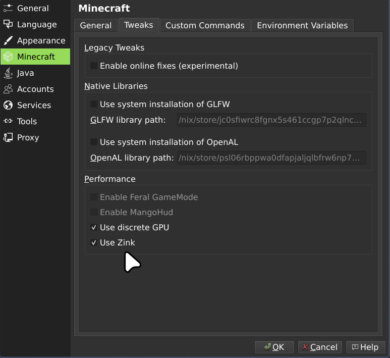

**Links:**
- [Back Home](../../README.md)
- [back to documentation key](./key-key.md)

---

# Gaming Fixes

### **minecraft**
Here is what i use when i encounter issues with minecraft on my system and it states:

> You are wanting to enable:

- **zink**: Zink is a driver that implements OpenGL on top of Vulkan, allowing applications to run OpenGL programs using Vulkan's capabilities

### **Steam Games**
Here are some fixes for Steam games:

- **Elden Ring anti-cheat**: args: `PROTON_EAC_RUNTIME=1 %command%`
- audio not working: args: `PULSE_SINK="game-cap" %command%`
- **Forcing Wayland on proton**: args: `PROTON_ENABLE_WAYLAND=1 %command%` Ref: https://www.youtube.com/@picoro-daimaku
